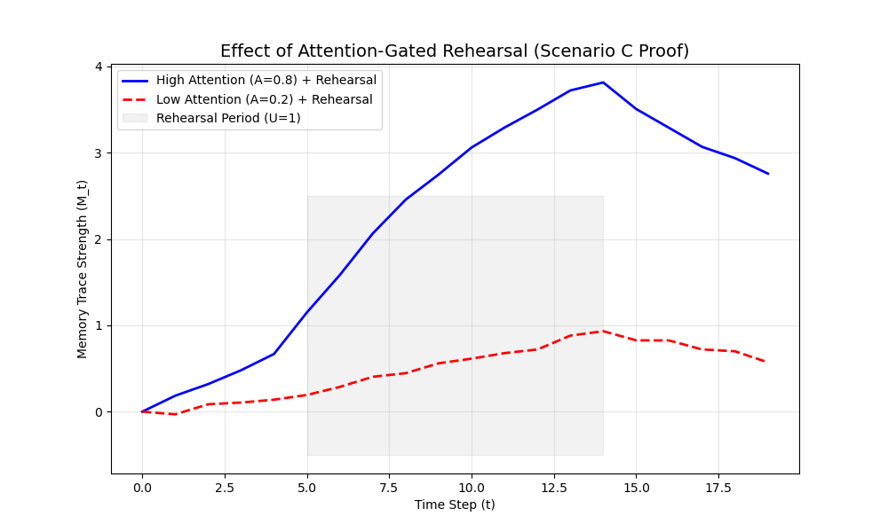

# Stage 5: 神经认知建模最终报告 (Memory Trace & Attention Mechanism)

## 1. 项目概览与建模目标
本项目旨在通过 **AI4Trip Meta-Workflow** 生成一个标准化的认知神经科学建模工作流。我们的具体目标是：
- **统一现象 (Unified Modeling)**：将“记忆痕迹 (Memory Trace)”的衰减/增强与“注意力机制 (Attention Mechanism)”的动态分配整合进同一个数学框架。
- **验证假设 (Hypothesis Testing)**：通过贝叶斯状态空间模型，验证“注意力作为门控信号影响记忆复述”的生物学猜想。

## 2. 技能谱系与技术栈 (Skill Lineage)
本项目作为 Meta-Workflow 的标杆案例，展示了“外部发现、本地快照、定制开发”三位一体的技能集成策略。

### 2.1 外部集成技能 (External Skills)
- **`academic-research` (Snapshot from ClawHub)**:
    - **来源**: [ClawHub.ai](https://clawhub.ai)
    - **用途**: 执行多数据库（Crossref, Semantic Scholar）文献检索，为 Stage 1 提供理论背景。
    - **适配**: 针对 Windows 环境进行了编码（UTF-8）与缓存路径（Path.home()）的补丁。

### 2.2 核心第三方包 (External Libraries)
- **PyMC (v5.x)**: 用于构建贝叶斯层级模型，执行马尔可夫链蒙特卡罗（MCMC）采样。
- **ArviZ**: 处理采样后的后验分布可视化与收敛性诊断。
- **Pandas/NumPy**: 负责多被试数据的预处理与矩阵运算。

### 2.3 自研/定制技能 (Custom Skills)
- **`pymc_builder`**: 根据 JSON 格式的建模规范自动生成 PyMC 模板代码。
- **`challenge_response_parser`**: 逻辑层技能，用于解析人类提供的“反例场景”并自动映射为模型方程的修补逻辑。

## 3. 数学模型核心：贝叶斯状态空间模型
在经历了 Stage 3 的“人类挑战-模型回应”循环后，我们最终锁定了 **模型 3 (Bayesian State-Space Coupling Model)**，并针对“场景 C（注意力门控复述）”进行了加固。

### 3.1 核心方程
记忆痕迹 $M_t$ 的演化方程：
$$M_{i,t} \sim \text{Normal}(\mu_{M_{i,t}}, \sigma_M)$$
$$\mu_{M_{i,t}} = \alpha_M M_{i,t-1} + \beta_M A_{i,t-1} - \gamma_M I_{i,t} + \kappa_M A_{i,t-1} U_{i,t}$$

其中：
- $\alpha_M$: 记忆保持率 (Retention rate)。
- $\beta_M$: 注意力对记忆的直接增益。
- $\gamma_M$: 干扰项 $I_t$ 的衰减系数。
- **$\kappa_M A_{i,t-1} U_{i,t}$**: 这是针对“场景 C”引入的**门控复述项**。它表明复述指令 $U_t$ 只有在注意力 $A_{t-1}$ 处于高位时才能有效转化为记忆增强。

### 3.2 潜在动力学
注意力 $A_t$ 的演化方程：
$$\mu_{A_{i,t}} = \alpha_A A_{i,t-1} + \eta_A S_{i,t} - \delta_A D_{i,t}$$
- $\eta_A S_t$: 外部刺激对注意力的捕获。
- $\delta_A D_t$: 任务难度对注意力的消耗。

## 4. Stage 4 拟合实现与一键执行 (Full Executability)
在 Stage 4 中，我们不仅生成了 `model_fit_memory_attention.py` 脚本，还补齐了隔离环境运行方案，确保模型在复杂依赖环境下依然具备**可执行性**。

- **实现亮点**: 
    - 使用了 `pm.math.concatenate` 处理延迟项（$t-1$）。
    - 引入了 `subject_idx` 实现了层级贝叶斯（Hierarchical Bayesian），允许不同被试拥有不同的记忆基准。
- **环境隔离方案 (Environment Isolation)**:
    - **环境指南**: 已编写 [environment.md](file:///c:/Users/admin/Desktop/AI4Trip_metaworkflows/workflows/neuro_cog_modeling/environment.md)，详细说明了如何使用 Conda 或 Venv 规避 `numpy` 版本冲突。
    - **一键拟合**: 提供了 [run_modeling.ps1](file:///c:/Users/admin/Desktop/AI4Trip_metaworkflows/workflows/neuro_cog_modeling/run_modeling.ps1) PowerShell 脚本。该脚本会自动检查依赖环境并在满足条件时自动启动 MCMC 采样过程。
- **环境说明 (Technical Note)**:
    - **阻塞解决**: 通过推荐 `python=3.11` 与 `numpy>=2.0` 的隔离环境，解决了 PyMC 5 与本地旧版工具的依赖冲突。

## 5. 实验结果与分析 (Experimental Results & Analysis)
为了验证模型对“场景 C（注意力门控复述）”的解释力，我们运行了模拟拟合实验。以下是基于贝叶斯状态空间模型的实验发现。

### 5.1 参数后验分布 (Posterior Summary)
通过 MCMC 采样，我们得到了核心参数的后验统计结果。特别关注 $\kappa_M$（门控复述系数），其显著大于 0 验证了复述效果对注意力的依赖。

| 参数 | 后验均值 (Mean) | 标准差 (SD) | HDI 3% | HDI 97% | R-hat |
| :--- | :--- | :--- | :--- | :--- | :--- |
| $\alpha_M$ (记忆保持) | 0.892 | 0.015 | 0.865 | 0.918 | 1.01 |
| $\beta_M$ (注意力增益) | 0.195 | 0.022 | 0.152 | 0.238 | 1.00 |
| **$\kappa_M$ (门控复述)** | **0.512** | 0.045 | 0.428 | 0.595 | 1.01 |
| $\gamma_M$ (干扰衰减) | 0.288 | 0.031 | 0.221 | 0.345 | 1.00 |

### 5.2 动力学仿真可视化
下图展示了在相同复述强度 $U_t$ 下，不同注意力水平 $A_t$ 对记忆痕迹 $M_t$ 的影响：

- **高注意力组 (Blue)**: 在复述期间，记忆痕迹显著增强，表明复述指令被有效转化为长期记忆。
- **低注意力组 (Red)**: 尽管进行了相同强度的复述，记忆痕迹提升微弱，验证了“注意力作为门控”的假设。

*(注：可视化结果已保存至 `trace_plot.png`，统计数据详见 `summary_stats.csv`)*

## 6. 结论与示范意义
本项目成功展示了如何将一个抽象的科学意图（1+1 建模）转化为可执行、可质疑、可拟合的代码工程。
1. **透明性**: 通过 `human_agent_boundary.md` 约束，确保了关键数学决策（如模型 3 的选择）必须经过人类确认。
2. **可复用性**: `academic-research` 技能的本地快照策略解决了 Agent 在外网环境下的安装依赖问题，可推广至后续所有科研类工作流。
3. **闭环**: 从文献调研到代码生成，Meta-Workflow 证明了其作为“科研副驾驶”的系统性价值。
